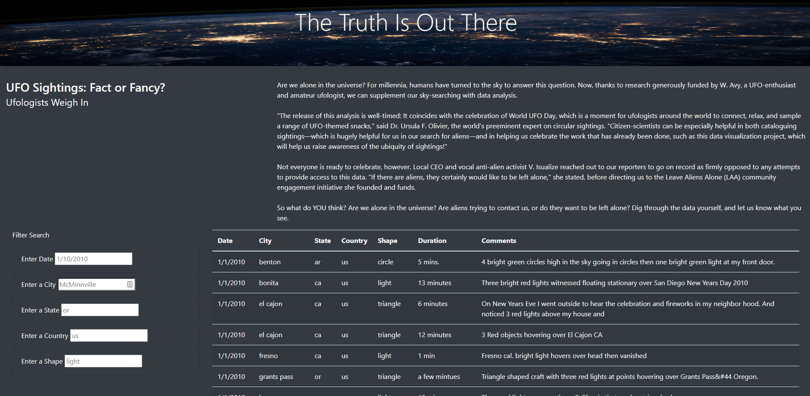
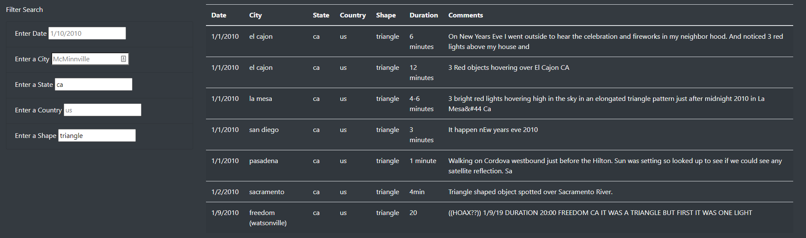

# UFOs

## Overview of Project

This analysis created a central, searchable repository, in website form, from a data set of UFO sightings. This makes finding, and cross referencing, UFO sightings data easier to look into and cross reference.

## Results

### Initial Visibility

Any visitor to the site can see immediately a table full of data. 

### Ease of Filtering 

From there, they can see how the data is arranged, and use the filters along the side to drill down into any specifics they may be interested in. For instance, if you wanted to see UFO sightings in California that were reported as a triangle shape, you simply type "ca" in the state filter, and "triangle" in the shape filter, and immediately get a list of all the sightings data from California with a reported triangle shape.

## Summary

While this approach of showing data is an easy way to give options for filtering, it does come with a drawback. Namely, there is currently no way to search the data based on comments or duration. 

### Recommendations

Additional filters could be added, although the coding would be more intensive, to search for incomplete matches within the comments field, and another filter for duration. For the duration you'd want to convert this column into a universal time space (probably measured in seconds of duration), so the code could block off and better understand those durations.

Another suggestion is simply getting more data into the program; while the data provided is interesting, it is limited in date range and completeness. The prospective searcher may be looking in places or for dates that are not well represented in the data set.
